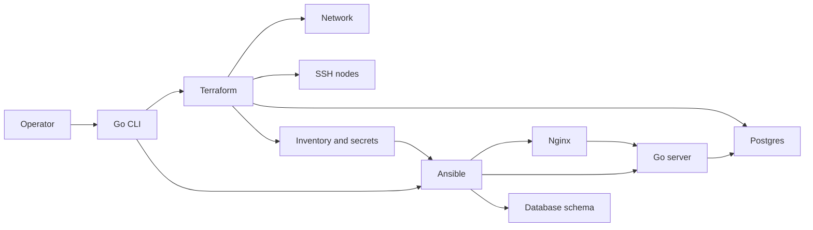

# Local platform lab

A small platform that shows how Terraform and Ansible split a job. Terraform provisions a Docker network, SSH nodes, and Postgres. Ansible configures those nodes. The service and the operator CLI are Go.



Terraform creates the runtime and emits the inventory. Ansible is the only thing that configures a machine. A second apply of each tool must change nothing. Dev is one app node behind the proxy. Prod is two app nodes, on its own ports, with Postgres unpublished.

The decisions are in [docs/architecture.md](docs/architecture.md). The smoke run is drawn in [docs/sequence.md](docs/sequence.md).

## Prerequisites

- A running Docker daemon. The CLI uses the current context, then the standard local sockets if that context is down.
- Go 1.22 or newer
- Terraform 1.6 or newer
- ansible-core 2.15 or newer

```sh
brew install go terraform ansible
```

## Run

From the repository, or any directory under it:

```sh
go run ./cmd/platform smoke -env dev
```

That builds the base image and the Linux server binary, applies the dev stack, and applies it again. The second apply must be `0 added, 0 changed, 0 destroyed`. It then runs the site playbook twice. The second run must report `changed=0`. It checks `http://127.0.0.1:18080/health` for `ok` and `/` for the environment name and database host.

`make smoke ENV=dev` is the same command. `make down ENV=dev` destroys it.

- `up` builds the base image and applies Terraform.
- `converge` builds the server, renders inventory, and runs Ansible.
- `smoke` runs the full path, including both idempotence checks.
- `down` destroys the environment.

Prod is a second composition: two app nodes, proxy port `18081`, and no published database port. It can be applied beside dev because names, networks, and host ports do not overlap.

```sh
go run ./cmd/platform smoke -env prod
```

## Layout

- `cmd/server` is the HTTP service. `GET /health` returns 200 only after Postgres answers.
- `cmd/platform` builds, applies, renders inventory, and runs Ansible.
- `infra/modules` is network, compute, and data. `infra/envs/dev` and `infra/envs/prod` compose them.
- `ansible/roles` is `common`, `proxy`, `app`, and `database`.
- `.local/` holds state-derived keys, inventory, and extra-vars. It is gitignored.

State stays on this machine. Do not commit it.
