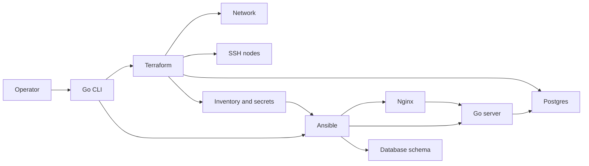

# Architecture

Terraform creates the runtime. Ansible configures it. A Go CLI drives both, and a Go service is the thing being configured. Neither tool reaches into the other's job.

## Ownership

Terraform owns networks, containers, the Postgres volume, and the SSH key. It does not install packages, render nginx or app config, or use provisioners.

Ansible owns users, packages, nginx, the server binary, the server config, and the database schema. It does not create containers.

`cmd/platform` shells out to Terraform and Ansible. It does not reimplement them. `cmd/server` is the process Ansible starts.

## Decisions

### Terraform does not configure machines

A provisioner would hide configuration in a one-shot remote-exec that cannot be tested or re-run cleanly. The base image contains SSH and Python only, so a new container is an empty machine. Ansible is what makes it a proxy or an app node. The same roles are what you would point at virtual machines later.

### Inventory comes from outputs

Terraform outputs hostnames, published SSH ports, and the sensitive connection values. The CLI turns that JSON into an inventory and a gitignored extra-vars file. Ansible never invents a hostname. Container names are Docker DNS names, so the proxy upstream list is the Ansible `app` group.

### Secrets stay in local state

The database password and the SSH private key are Terraform-managed. State and the generated extra-vars file are gitignored. A production environment would replace that handoff with a secrets manager. The module boundary would stay: Terraform still publishes the values, Ansible still consumes them, and they still do not live in git.

### The service manager is a fact

systemd inside Docker Desktop is not reliable, so each service role ships a systemd unit and a process runner. A task in the `common` role reads pid 1 and sets `platform_service_mgr`. Handlers and start tasks use that fact. On a virtual machine whose pid 1 is systemd, the unit file is the path that runs. In this lab, pid 1 is `sshd`, so the process runner starts the service and detaches it from the SSH session. Handlers flush before the start task. If the process is already running, that start is not a change.

The database is not an SSH target. Ansible installs the Postgres client on an app host and creates the `app` schema from there, over the Docker network. The control machine never needs a published database port. Dev publishes only SSH and the proxy. Prod uses a second app node and a different proxy port so both environments can exist at once. Prod still does not publish Postgres or the app port.

## What would change on real machines

Replace the network and compute modules with a cloud VPC and instances. Point state at a remote backend. The process-runner branch becomes unused once pid 1 is systemd. Playbooks, the inventory contract, and the server config file stay.
