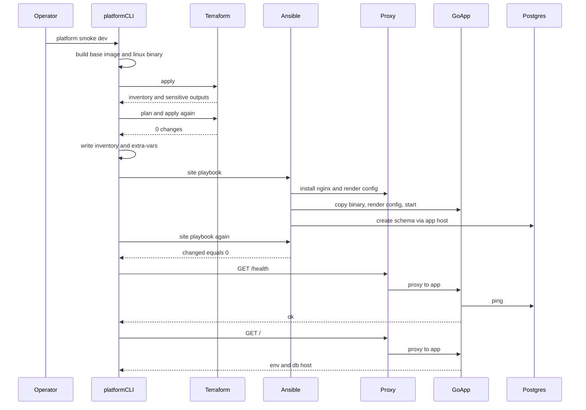

# Smoke sequence

`go run ./cmd/platform smoke -env dev` is the path a reviewer runs. Prod uses the same sequence with different container names and ports.

## Build

The CLI cross-compiles `cmd/server` for the Docker daemon's architecture and builds `platform-lab-base:local` from `images/base`. The image is SSH and Python. The Go binary is not in the image.

## Apply

Terraform reads the local image id, writes an SSH key under `.local/<env>/`, and creates the network, the Postgres container and volume, and one container per node. Dev is one proxy and one app node. Prod is one proxy and two app nodes. Postgres listens only on the platform network.

## Idempotent apply

Smoke runs `terraform plan -detailed-exitcode` and a second `terraform apply`. The second apply must report `0 added, 0 changed, 0 destroyed`. Configuration drift would show up here, before Ansible runs.

## Render

`terraform output -json` becomes `.local/<env>/inventory.ini` and `.local/<env>/extra-vars.json`. The extra-vars file holds the database password and the path to the private key. Both files are gitignored.

## Converge

The site playbook waits for SSH, then runs `common`, `proxy`, `app`, and `database`. The app role copies `dist/server`, renders `/etc/platform/config.json`, flushes handlers, and starts the process only when it is not already running. The database role runs once on an app host and creates the `app` schema if it is missing.

## Idempotent playbook

Smoke runs the playbook a second time and reads the PLAY RECAP. Every host must report `changed=0`. A start that finds nginx or the server already running does not count as a change. Package installs, templates, and the schema check are written so a second run does not alter the machine.

## Health

The CLI calls `http://127.0.0.1:<proxy port>/health` and `/`, and retries for a minute. `/health` must be `ok`. `/` must show the environment name and database host. Nginx proxies to the app group. The Go server pings Postgres and returns 200 only when that ping succeeds. Dev's proxy port is 18080. Prod's is 18081.
